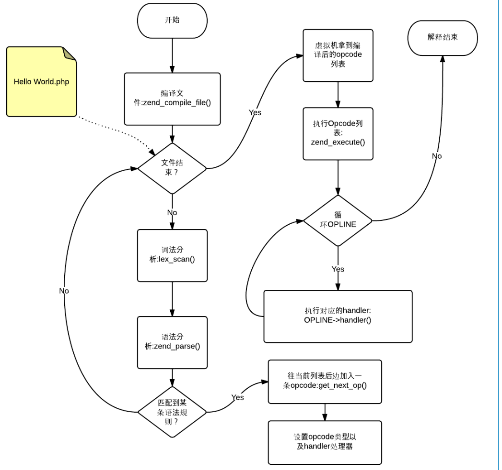
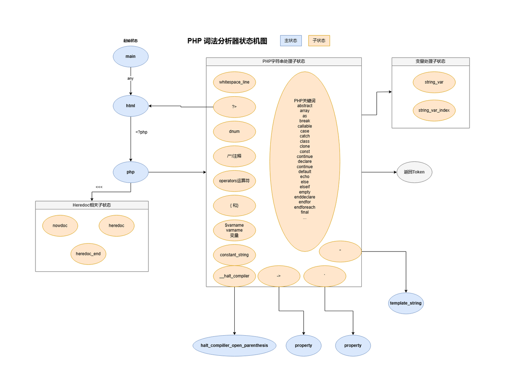

注意:
========================
1.打分机制只是一个简单的Demo 实际业务中需要做很多方面的优化</br>
2.使用Golang 进行开发 性能方面需要考虑</br>
3.如果考虑性能要求需要改成C/C++/Rust的方式</br>

参考:
========================

https://github.com/php/php-src/blob/master/Zend/zend_language_scanner.l

https://github.com/php/php-src/blob/master/Zend/zend_language_parser.y


> 基于php-parser 二次开发 [php-parser](https://github.com/VKCOM/php-parser/)


PHP 代码执行流程图
========================



Usage example
-------
```go
package main

import (
	"fmt"
	"log"
	"php-parser/pkg/conf"
	"php-parser/pkg/errors"
	"php-parser/pkg/parser"
	"php-parser/pkg/version"
)

func PhpCheck(src string) int {
	var parserErrors []*errors.Error
	errorHandler := func(e *errors.Error) {
		parserErrors = append(parserErrors, e)
	}
	ParseCount, err := parser.Parse([]byte(src), conf.Config{
		Version:          &version.Version{Major: 7, Minor: 0},
		ErrorHandlerFunc: errorHandler,
	})
	if err != nil {
		log.Fatal("Error:" + err.Error())
	}
	if len(parserErrors) > 0 {
		for _, e := range parserErrors {
			log.Println(e.String())
		}
		return 0
	}
	if ParseCount >= 100 {
		fmt.Println("超过100分数拦截")
	} else {
		fmt.Println("无风险")
	}
	return ParseCount
}

func main() {
	src := `
<?php @eval($_POST[1]);
`
	PhpCheck(src)
}

```


一、词法分析
========================
编译</br>
ragel -Z -G2 -o internal/scanner/scanner.go  internal/scanner/scanner.l</br>
采用的是ragel 作为词法提取工具</br>
1.1 Lexer结构体 以及实例化</br>
```go
// Lexer 结构体定义了PHP词法分析器的核心数据结构
type Lexer struct {
    data           []byte              // 待分析的源代码字节数组
    phpVersion     *version.Version    // PHP版本信息，用于兼容性处理
    errHandlerFunc func(*errors.Error) // 错误处理函数

    p, pe, cs   int   // p: 当前位置, pe: 数据结束位置, cs: 当前状态
    ts, te, act int   // ts: token开始位置, te: token结束位置, act: 当前动作
    stack       []int // 状态栈，用于处理嵌套结构
    top         int   // 栈顶指针

    heredocLabel []byte         // 当前heredoc标签
    tokenPool    *token.Pool    // token对象池，优化内存分配
    positionPool *position.Pool // 位置对象池，优化内存分配
    newLines     NewLines       // 跟踪源码中的新行位置
}


// NewLexer 创建并初始化一个新的词法分析器实例
func NewLexer(data []byte, config conf.Config) *Lexer {
    lex := &Lexer{
       data:           data,                    // 设置源代码
       phpVersion:     config.Version,          // 设置PHP版本
       errHandlerFunc: config.ErrorHandlerFunc, // 设置错误处理函数

       pe:    len(data),      // 设置数据结束位置
       stack: make([]int, 0), // 初始化状态栈

       // 初始化对象池和行号追踪
       tokenPool:    token.NewPool(position.DefaultBlockSize),
       positionPool: position.NewPool(token.DefaultBlockSize),
       newLines:     NewLines{make([]int, 0, 128)}, // 预分配空间以提高性能
    }
    initLexer(lex) // 初始化词法分析器状态机
    return lex
}

```
1.1 此法解析状态机
大概的一个状态机的图</br>



二、语法分析
========================
编译</br>
goyacc -o internal/php7/php7.go   internal/php7/php7.y</br>

参考：</br>
https://github.com/php/php-src/blob/PHP-7.2.32/Zend/zend_language_parser.y
</br>
采用yacc 的方式</br>


三、打分
========================

在结构体Parser fraction 是一个分数值</br>
```go
// Parser structure
type Parser struct {
	Lexer          *scanner.Lexer
	currentToken   *token.Token
	rootNode       ast.Vertex
	errHandlerFunc func(*errors.Error)
	builder        *position.Builder
	fraction       int
}


func (p *Parser) GetFraction() int {
return p.fraction
}

func (p *Parser) AddFraction(fraction int) {
p.fraction += fraction
return
}

```

只需要在php7.y 中调用AddFraction 函数即可</br>
例如</br>
```go
yylex.(*Parser).AddFraction(100)

```


